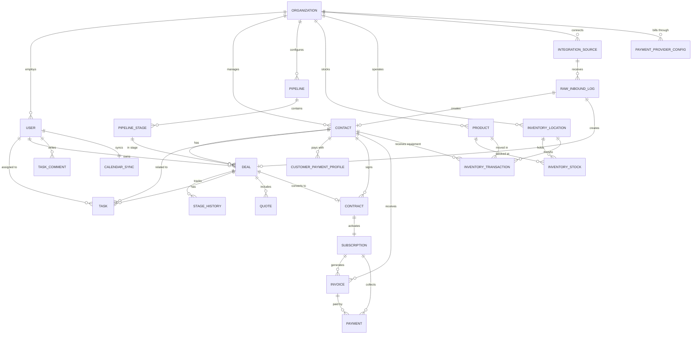

# CRM Extended Data Models

## 1. Task & Calendar Management

### TASK
```
TASK {
    uuid        id PK
    uuid        organization_id FK
    uuid        contact_id FK           -- nullable
    uuid        deal_id FK              -- nullable
    uuid        assigned_to FK          -- USER.id
    uuid        created_by FK           -- USER.id
    string      title                   -- "Follow up on quote"
    text        description             -- optional details
    string      priority                -- "low" | "medium" | "high" | "urgent"
    string      status                  -- "pending" | "in_progress" | "completed" | "cancelled"
    string      type                    -- "call" | "email" | "meeting" | "site_visit" | "install" | "follow_up" | "other"
    date        due_date
    time        due_time                -- nullable, for time-specific tasks
    int         duration_minutes        -- estimated duration (for calendar blocking)
    boolean     is_all_day              -- true for date-only tasks
    string      recurrence              -- nullable: "daily" | "weekly" | "monthly" | "none"
    string      external_calendar_id    -- Google/Outlook event ID for synced events
    timestamp   completed_at
    uuid        completed_by FK
    timestamp   created_at
    timestamp   updated_at
}
```

### TASK_COMMENT
```
TASK_COMMENT {
    uuid        id PK
    uuid        task_id FK
    uuid        user_id FK
    text        content
    timestamp   created_at
}
```

### CALENDAR_SYNC
```
CALENDAR_SYNC {
    uuid        id PK
    uuid        user_id FK
    string      provider                -- "google" | "outlook"
    string      external_calendar_id    -- the calendar ID from the provider
    string      access_token            -- encrypted
    string      refresh_token           -- encrypted
    string      sync_direction          -- "bidirectional" | "crm_to_calendar" | "calendar_to_crm"
    timestamp   last_synced_at
    string      status                  -- "active" | "disconnected" | "error"
    timestamp   created_at
    timestamp   updated_at
}
```

### Key behaviors:
- Creating a task with a due_date and due_time auto-creates a calendar event if sync is active
- Completing a task logs it as an activity on the contact/deal timeline
- Overdue tasks surface on the dashboard and in notifications
- Tasks can be created from the deal pipeline (quick action), contact record, or standalone
- Recurring tasks auto-generate the next instance on completion

---

## 2. Inventory Management

### PRODUCT
```
PRODUCT {
    uuid        id PK
    uuid        organization_id FK
    string      name                    -- "Outdoor Camera - 2K"
    string      sku                     -- "CAM-OUT-2K"
    string      category                -- "camera" | "sensor" | "panel" | "doorbell" | "fob" | "accessory" | "other"
    text        description
    decimal     unit_cost               -- what the dealer pays
    decimal     retail_price            -- what the customer pays
    int         reorder_threshold       -- alert when total quantity falls below this
    boolean     is_active               -- soft delete / discontinue
    string      image_url               -- nullable
    timestamp   created_at
    timestamp   updated_at
}
```

### INVENTORY_LOCATION
```
INVENTORY_LOCATION {
    uuid        id PK
    uuid        organization_id FK
    string      name                    -- "Main Warehouse" | "Truck - Mike S." | "Office"
    string      type                    -- "warehouse" | "vehicle" | "office"
    uuid        assigned_user_id FK     -- nullable, for vehicle type (which tech's truck)
    string      address                 -- nullable
    boolean     is_active
    timestamp   created_at
}
```

### INVENTORY_STOCK
```
INVENTORY_STOCK {
    uuid        id PK
    uuid        product_id FK
    uuid        location_id FK
    int         quantity                -- current count at this location
    timestamp   updated_at

    UNIQUE(product_id, location_id)     -- one row per product per location
}
```

### INVENTORY_TRANSACTION
```
INVENTORY_TRANSACTION {
    uuid        id PK
    uuid        organization_id FK
    uuid        product_id FK
    uuid        from_location_id FK     -- nullable (null for receiving new stock)
    uuid        to_location_id FK       -- nullable (null for install/usage)
    uuid        deal_id FK              -- nullable (linked if used in an install)
    uuid        contact_id FK           -- nullable (which customer received equipment)
    uuid        performed_by FK         -- USER.id
    string      type                    -- "receive" | "transfer" | "install" | "return" | "adjustment" | "write_off"
    int         quantity
    text        notes                   -- "Installed at 456 Oak Lane"
    timestamp   created_at
}
```

### Key behaviors:
- When a deal reaches "installed" stage, tech logs equipment used. Creates INVENTORY_TRANSACTION with type "install", decrements INVENTORY_STOCK at the truck location.
- Transfers between locations (warehouse to truck) create a transaction that decrements source and increments destination.
- Low stock alerts trigger when any PRODUCT's total quantity across all locations falls below reorder_threshold.
- Customer equipment history: query INVENTORY_TRANSACTION by contact_id to see everything installed at their property (for service calls and warranty).
- Dashboard widget: low stock items, stock by location, equipment cost per install.

---

## 3. Auth & Permissions (RBAC)

### ORGANIZATION
```
ORGANIZATION {
    uuid        id PK
    string      name                    -- "Smith Security LLC"
    string      slug                    -- "smith-security" (for subdomain or URL path)
    string      email                   -- primary contact email
    string      phone
    string      address_line1
    string      address_line2
    string      city
    string      state
    string      zip
    string      logo_url
    string      timezone                -- "America/Chicago"
    string      currency                -- "usd"
    string      plan                    -- "free" | "starter" | "pro" | "enterprise"
    jsonb       settings                -- org-level config (invoice template, notification prefs, etc.)
    timestamp   created_at
    timestamp   updated_at
}
```

### USER (updated for multi-tenancy)
```
USER {
    uuid        id PK
    uuid        organization_id FK
    string      email
    string      password_hash
    string      first_name
    string      last_name
    string      phone
    string      role                    -- "owner" | "admin" | "manager" | "sales_rep" | "technician"
    string      avatar_url
    boolean     is_active
    string      refresh_token           -- encrypted, for JWT refresh
    timestamp   last_login_at
    timestamp   created_at
    timestamp   updated_at
}
```

### Role Permissions Matrix

| Permission | Owner | Admin | Manager | Sales Rep | Technician |
|-----------|-------|-------|---------|-----------|------------|
| View all contacts | yes | yes | yes | own only | assigned only |
| Create contacts | yes | yes | yes | yes | no |
| Edit any contact | yes | yes | yes | own only | no |
| Delete contacts | yes | yes | no | no | no |
| View all deals | yes | yes | yes | own only | no |
| Create deals | yes | yes | yes | yes | no |
| Move deal stages | yes | yes | yes | own only | no |
| View all contracts | yes | yes | yes | own only | no |
| Create contracts | yes | yes | yes | no | no |
| View revenue/MRR | yes | yes | yes | no | no |
| View all tasks | yes | yes | yes | own only | own only |
| Create tasks for others | yes | yes | yes | no | no |
| Manage inventory | yes | yes | yes | no | view truck only |
| Transfer inventory | yes | yes | yes | no | own truck only |
| View all reports | yes | yes | yes | limited | no |
| Manage integrations | yes | yes | no | no | no |
| Manage users | yes | yes | no | no | no |
| Billing / plan | yes | yes | no | no | no |
| Organization settings | yes | yes | no | no | no |

### JWT Token Structure
```json
{
    "sub": "user_uuid",
    "org": "organization_uuid",
    "role": "sales_rep",
    "email": "mike@smithsecurity.com",
    "iat": 1709000000,
    "exp": 1709003600
}
```

Access token TTL: 1 hour
Refresh token TTL: 30 days
Refresh token rotation: issue new refresh token on each refresh

### Auth Endpoints
```
POST /api/v1/auth/register          -- create org + owner user
POST /api/v1/auth/login             -- email + password, returns access + refresh tokens
POST /api/v1/auth/refresh           -- refresh token, returns new access + refresh tokens
POST /api/v1/auth/logout            -- invalidate refresh token
POST /api/v1/auth/forgot-password   -- send reset email
POST /api/v1/auth/reset-password    -- set new password from reset token
POST /api/v1/auth/invite            -- owner/admin invites a user by email
POST /api/v1/auth/accept-invite     -- invited user sets password and activates
```

---

## 4. Multi-Tenancy

### Strategy: Shared database, organization_id on every table.

Every query is scoped by organization_id. This is enforced at the ORM level so it's impossible to accidentally query across tenants.

```python
# SQLAlchemy example: automatic tenant scoping
class TenantQuery(Query):
    def get(self, ident):
        obj = super().get(ident)
        if obj and hasattr(obj, 'organization_id'):
            if obj.organization_id != g.current_org_id:
                return None
        return obj

# Middleware extracts org_id from JWT on every request
@app.middleware("http")
async def tenant_middleware(request, call_next):
    token = decode_jwt(request.headers.get("Authorization"))
    request.state.org_id = token["org"]
    request.state.user_id = token["sub"]
    request.state.role = token["role"]
    return await call_next(request)
```

### URL Structure
```
/api/v1/contacts            -- automatically scoped to JWT org
/api/v1/deals               -- automatically scoped to JWT org
/api/v1/reports/mrr          -- automatically scoped to JWT org
```

No org_id in URLs. Everything inferred from the JWT. Clean and secure.

### Data Isolation Checklist
- Every table (except USER and ORGANIZATION) has organization_id FK
- Every SELECT query includes WHERE organization_id = current_org
- Every INSERT sets organization_id from the JWT
- API tests verify cross-tenant data is never leaked
- Database indexes include organization_id for performance

---

## 5. Analytics Specifications

### Dashboard: Owner / Admin View

**KPI Row (top)**
| Metric | Calculation | Comparison |
|--------|------------|------------|
| MRR | SUM(subscription.amount) WHERE status = 'active' | vs last month |
| Pipeline Value | SUM(deal.estimated_value) WHERE stage NOT IN ('lost', 'contract_signed') | vs last month |
| Deals Won (this month) | COUNT(deal) WHERE stage = 'contract_signed' AND closed this month | vs last month |
| Conversion Rate | Deals won / total deals created this period | vs last month |

**Charts**
| Chart | Type | Data |
|-------|------|------|
| Revenue Over Time | Line chart | MRR by month, trailing 12 months |
| Pipeline by Stage | Horizontal bar | Deal count and value per stage |
| Lead Source Performance | Donut/pie | Deals by lead_source, sized by value |
| Rep Leaderboard | Table/bar | Revenue per rep, deals closed, activities logged |
| Recent Activity Feed | List | Latest activities across all reps |
| Stale Deals | Table | Deals sitting in a stage > X days |
| Failed Payments | Alert list | Recent failed payment attempts |
| Upcoming Renewals | Table | Contracts expiring in next 90 days |

### Dashboard: Sales Rep View

**KPI Row**
| Metric | Calculation |
|--------|------------|
| My Open Deals | COUNT(deal) WHERE assigned_to = me AND stage NOT IN ('lost', 'contract_signed') |
| My Pipeline Value | SUM(deal.estimated_value) for my open deals |
| Deals Closed (this month) | COUNT(deal) WHERE assigned_to = me AND closed this month |
| Tasks Due Today | COUNT(task) WHERE assigned_to = me AND due_date = today AND status = 'pending' |

**Charts**
| Chart | Type |
|-------|------|
| My Pipeline | Horizontal bar by stage |
| My Activity This Week | Bar chart (calls, emails, visits by day) |
| My Tasks | List of upcoming and overdue |

### Reports (accessible from Reports section)

**Pipeline Reports**
- Pipeline snapshot: all deals by stage with values
- Pipeline velocity: average days per stage
- Win/loss analysis: reasons for lost deals
- Stage conversion rates: % that advance from each stage
- Deal aging: how long deals sit in each stage

**Revenue Reports**
- MRR trend (monthly)
- Net new MRR (new contracts minus cancellations)
- Churn rate (monthly, quarterly)
- Average Revenue Per Account
- Lifetime Value estimate
- Revenue by lead source (ROI)
- Revenue at risk (expiring contracts)

**Activity Reports**
- Activities per rep (calls, emails, meetings, site visits)
- Speed to lead (time from lead received to first contact)
- Follow-up adherence (% of tasks completed on time)

**Inventory Reports**
- Current stock by location
- Low stock alerts
- Equipment cost per install (average)
- Product usage frequency

**All reports support:**
- Date range filter
- Rep filter
- Lead source filter
- Export to CSV
- Drill-down (click a bar to see underlying records)

---

## 6. Pipeline Configuration

### PIPELINE
```
PIPELINE {
    uuid        id PK
    uuid        organization_id FK
    string      name                    -- "Sales Pipeline" | "Service Pipeline"
    boolean     is_default
    int         sort_order
    timestamp   created_at
}
```

### PIPELINE_STAGE
```
PIPELINE_STAGE {
    uuid        id PK
    uuid        pipeline_id FK
    string      name                    -- "New Lead"
    string      color                   -- hex color for kanban column header
    int         sort_order              -- determines column position
    boolean     is_won_stage            -- true for "Contract Signed" type stages
    boolean     is_lost_stage           -- true for "Lost" stage
    int         stale_days              -- warn if deal sits here > X days (nullable)
    boolean     is_active
    timestamp   created_at
}
```

### Default stages (created on org registration):
1. New Lead (color: #6C63FF)
2. Contacted (color: #3B82F6)
3. Consultation Scheduled (color: #8B5CF6)
4. Quote Sent (color: #F59E0B)
5. Negotiation (color: #F97316)
6. Install Scheduled (color: #22C55E)
7. Installed (color: #14B8A6)
8. Contract Signed (color: #10B981, is_won_stage: true)
9. Lost (color: #EF4444, is_lost_stage: true)

Business owners can add, remove, reorder, and rename stages. The is_won_stage and is_lost_stage flags drive reporting logic.

---

## Entity Relationships (Complete)


