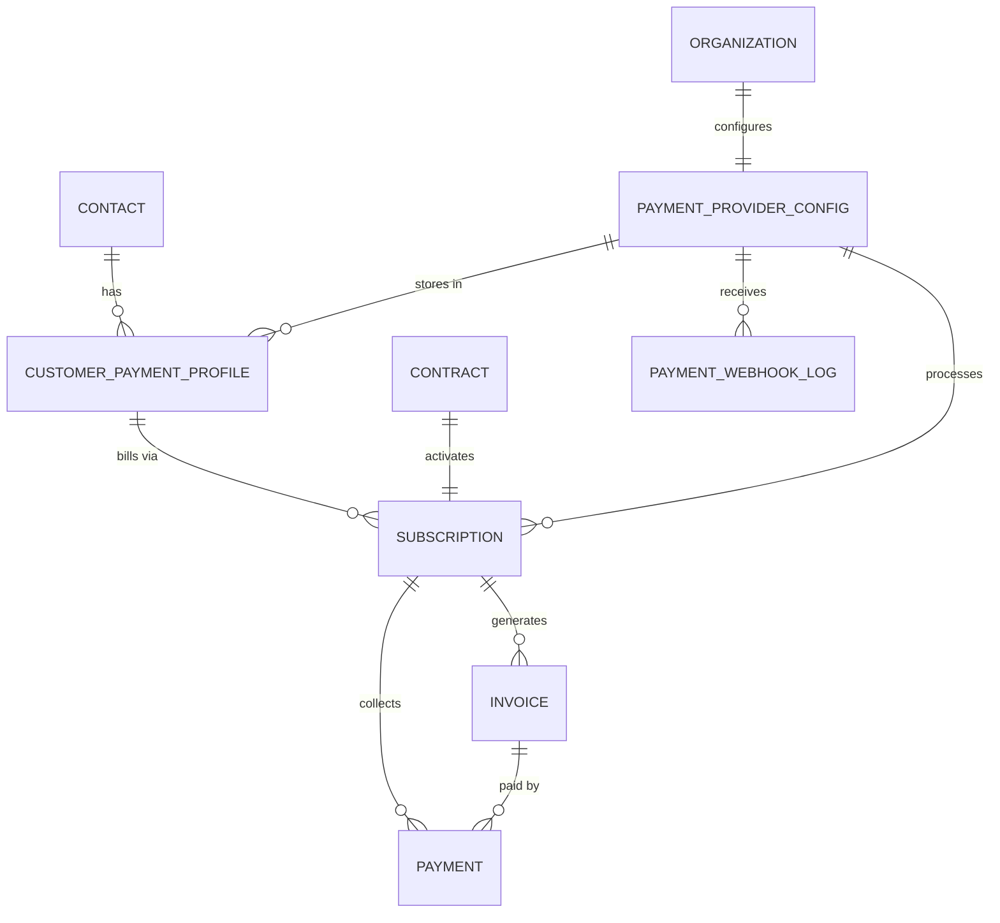

# CRM Payment Abstraction Layer

## Overview

The payment layer abstracts all payment processor interactions behind a common interface. The CRM never talks directly to Stripe or Authorize.net. It talks to the PaymentService, which delegates to the appropriate adapter based on the organization's configured processor.

```
                          ┌─────────────────────┐
                          │     CRM Backend      │
                          │  (Contract, Invoice,  │
                          │   Payment modules)    │
                          └──────────┬────────────┘
                                     │
                          ┌──────────▼────────────┐
                          │   PaymentService      │
                          │   (Common Interface)   │
                          └──────────┬────────────┘
                                     │
                    ┌────────────────┼────────────────┐
                    │                │                 │
           ┌────────▼──────┐ ┌──────▼───────┐ ┌──────▼───────┐
           │ StripeAdapter │ │ AuthNetAdapter│ │ SquareAdapter │
           │               │ │              │ │  (future)     │
           └────────┬──────┘ └──────┬───────┘ └──────┬───────┘
                    │               │                 │
              Stripe API    Authorize.net API    Square API
```

---

## Data Model Additions

### PAYMENT_PROVIDER_CONFIG

Each organization configures their payment processor here. One org, one active processor.

```
PAYMENT_PROVIDER_CONFIG {
    uuid        id PK
    uuid        organization_id FK
    string      provider_type           -- "stripe" | "authorize_net" | "square"
    string      display_name            -- "Authorize.net - Main Account"
    boolean     is_active               -- only one active per org
    jsonb       credentials             -- encrypted: API keys, merchant ID, etc.
    string      environment             -- "sandbox" | "production"
    jsonb       settings                -- provider-specific config (see below)
    boolean     auto_invoice            -- automatically email invoices on charge
    int         retry_failed_days       -- how many days to retry failed payments (default: 14)
    int         retry_max_attempts      -- max retry attempts (default: 3)
    timestamp   created_at
    timestamp   updated_at
}
```

#### Credentials by Provider (encrypted at rest)

**Stripe:**
```json
{
    "secret_key": "sk_live_...",
    "publishable_key": "pk_live_...",
    "webhook_signing_secret": "whsec_..."
}
```

**Authorize.net:**
```json
{
    "api_login_id": "...",
    "transaction_key": "...",
    "signature_key": "...",
    "public_client_key": "..."
}
```

#### Settings by Provider

**Stripe:**
```json
{
    "default_payment_method_types": ["card", "us_bank_account"],
    "invoice_days_until_due": 0,
    "send_invoice_email": true,
    "dunning_enabled": true
}
```

**Authorize.net:**
```json
{
    "validation_mode": "liveMode",
    "duplicate_window": 120,
    "email_customer": true,
    "arb_trial_enabled": false
}
```

### CUSTOMER_PAYMENT_PROFILE

Links a CRM contact to their profile in the payment processor. Stores the external IDs so you can always reference back to the processor.

```
CUSTOMER_PAYMENT_PROFILE {
    uuid        id PK
    uuid        organization_id FK
    uuid        contact_id FK
    uuid        provider_config_id FK
    string      external_customer_id    -- Stripe: "cus_xxx" | AuthNet: "customerProfileId"
    string      external_payment_id     -- Stripe: "pm_xxx" | AuthNet: "paymentProfileId"
    string      payment_method_type     -- "card" | "ach" | "bank_account"
    string      payment_method_last4    -- last 4 digits for display
    string      payment_method_brand    -- "visa" | "mastercard" | "amex" (cards only)
    int         payment_method_exp_month -- card expiry month (nullable)
    int         payment_method_exp_year  -- card expiry year (nullable)
    boolean     is_default              -- default payment method for this contact
    string      status                  -- "active" | "expired" | "failed"
    timestamp   created_at
    timestamp   updated_at
}
```

### SUBSCRIPTION (replaces/extends CONTRACT payment fields)

The subscription record in the CRM that maps to a recurring billing object in the processor.

```
SUBSCRIPTION {
    uuid        id PK
    uuid        organization_id FK
    uuid        contract_id FK          -- links to the CRM contract
    uuid        contact_id FK
    uuid        provider_config_id FK
    uuid        customer_payment_profile_id FK
    string      external_subscription_id -- Stripe: "sub_xxx" | AuthNet: ARB subscription ID
    string      status                  -- "active" | "past_due" | "cancelled" | "paused" | "expired"
    decimal     amount                  -- monthly charge amount
    string      currency                -- "usd"
    string      billing_interval        -- "monthly" | "quarterly" | "annual"
    int         billing_interval_count  -- 1 for monthly, 3 for quarterly, etc.
    date        billing_anchor_day      -- day of month to charge (1-28)
    date        current_period_start
    date        current_period_end
    date        next_billing_date
    int         failed_payment_count    -- consecutive failures
    timestamp   last_payment_at
    timestamp   cancelled_at
    string      cancellation_reason
    timestamp   created_at
    timestamp   updated_at
}
```

### INVOICE

Individual invoice records. Generated per billing period, whether auto-generated from subscription or manually created.

```
INVOICE {
    uuid        id PK
    uuid        organization_id FK
    uuid        contact_id FK
    uuid        contract_id FK
    uuid        subscription_id FK      -- nullable for one-time invoices
    uuid        provider_config_id FK
    string      external_invoice_id     -- Stripe: "in_xxx" | AuthNet: generated internally
    string      invoice_number          -- human-readable: "INV-2025-0001"
    string      status                  -- "draft" | "sent" | "paid" | "past_due" | "void" | "uncollectible"
    date        invoice_date
    date        due_date
    date        period_start            -- billing period this covers
    date        period_end
    decimal     subtotal
    decimal     tax_amount
    decimal     total
    decimal     amount_paid
    decimal     amount_due              -- total - amount_paid
    string      currency                -- "usd"
    text        memo                    -- optional note on invoice
    jsonb       line_items              -- array of line items (see below)
    string      pdf_url                 -- link to generated PDF
    timestamp   sent_at                 -- when emailed to customer
    timestamp   paid_at
    timestamp   voided_at
    timestamp   created_at
    timestamp   updated_at
}
```

#### Line Items Structure

```json
{
    "line_items": [
        {
            "description": "Monthly Security Monitoring - Pro Plan",
            "quantity": 1,
            "unit_price": 44.99,
            "amount": 44.99
        },
        {
            "description": "Equipment Lease - 4 Cameras",
            "quantity": 1,
            "unit_price": 15.00,
            "amount": 15.00
        }
    ]
}
```

### PAYMENT (updated from original data model)

```
PAYMENT {
    uuid        id PK
    uuid        organization_id FK
    uuid        contact_id FK
    uuid        contract_id FK
    uuid        subscription_id FK      -- nullable
    uuid        invoice_id FK           -- nullable
    uuid        provider_config_id FK
    string      external_payment_id     -- Stripe: "pi_xxx" or "ch_xxx" | AuthNet: "transId"
    string      status                  -- "succeeded" | "failed" | "pending" | "refunded" | "partially_refunded"
    decimal     amount
    decimal     amount_refunded         -- 0 if no refund
    string      currency                -- "usd"
    string      payment_method_type     -- "card" | "ach"
    string      payment_method_last4
    date        payment_date
    date        period_start            -- what billing period this covers
    date        period_end
    string      failure_code            -- processor error code
    string      failure_message         -- human-readable failure reason
    int         attempt_number          -- 1st attempt, 2nd retry, etc.
    timestamp   created_at
}
```

### PAYMENT_WEBHOOK_LOG

Raw webhook events from the processor. Same philosophy as RAW_INBOUND_LOG: store everything, process after.

```
PAYMENT_WEBHOOK_LOG {
    uuid        id PK
    uuid        organization_id FK
    uuid        provider_config_id FK
    string      external_event_id       -- Stripe: "evt_xxx" | AuthNet: webhook ID
    string      event_type              -- "payment.succeeded" | "payment.failed" | "subscription.cancelled" etc.
    jsonb       raw_payload             -- full webhook body
    string      processing_status       -- "received" | "processed" | "error" | "ignored"
    text        error_message
    timestamp   received_at
    timestamp   processed_at
}
```

---

## Common Payment Interface

This is the contract that every adapter must implement. The CRM backend only calls these methods.

```python
from abc import ABC, abstractmethod
from dataclasses import dataclass
from typing import Optional
from datetime import date
from decimal import Decimal


@dataclass
class CustomerResult:
    external_customer_id: str
    external_payment_id: Optional[str]
    payment_method_last4: Optional[str]
    payment_method_brand: Optional[str]
    payment_method_type: str


@dataclass
class SubscriptionResult:
    external_subscription_id: str
    status: str
    next_billing_date: date
    current_period_start: date
    current_period_end: date


@dataclass
class ChargeResult:
    external_payment_id: str
    status: str  # "succeeded" | "failed" | "pending"
    amount: Decimal
    failure_code: Optional[str]
    failure_message: Optional[str]


@dataclass
class InvoiceResult:
    external_invoice_id: str
    status: str
    pdf_url: Optional[str]
    amount_due: Decimal


@dataclass
class RefundResult:
    external_refund_id: str
    status: str
    amount_refunded: Decimal


class PaymentAdapter(ABC):
    """
    Common interface for all payment processor adapters.
    Every method returns a standardized result object.
    The CRM never sees processor-specific data structures.
    """

    # ── Customer Management ──────────────────────────────

    @abstractmethod
    async def create_customer(
        self,
        email: str,
        name: str,
        phone: Optional[str] = None,
        metadata: Optional[dict] = None
    ) -> CustomerResult:
        """Create a customer profile in the processor."""
        pass

    @abstractmethod
    async def update_customer(
        self,
        external_customer_id: str,
        email: Optional[str] = None,
        name: Optional[str] = None,
        phone: Optional[str] = None
    ) -> CustomerResult:
        """Update customer details in the processor."""
        pass

    @abstractmethod
    async def delete_customer(
        self,
        external_customer_id: str
    ) -> bool:
        """Remove customer from processor. Returns True on success."""
        pass

    # ── Payment Method ───────────────────────────────────

    @abstractmethod
    async def attach_payment_method(
        self,
        external_customer_id: str,
        payment_token: str  # tokenized card/bank from frontend
    ) -> CustomerResult:
        """Attach a payment method to a customer."""
        pass

    @abstractmethod
    async def remove_payment_method(
        self,
        external_customer_id: str,
        external_payment_id: str
    ) -> bool:
        """Remove a payment method. Returns True on success."""
        pass

    # ── Subscriptions (Recurring Billing) ────────────────

    @abstractmethod
    async def create_subscription(
        self,
        external_customer_id: str,
        amount: Decimal,
        interval: str,  # "monthly" | "quarterly" | "annual"
        start_date: date,
        description: str,
        billing_day: Optional[int] = None,  # day of month
        trial_days: Optional[int] = None
    ) -> SubscriptionResult:
        """Set up recurring billing for a customer."""
        pass

    @abstractmethod
    async def cancel_subscription(
        self,
        external_subscription_id: str,
        cancel_at_period_end: bool = True  # cancel now vs end of period
    ) -> SubscriptionResult:
        """Cancel a recurring subscription."""
        pass

    @abstractmethod
    async def pause_subscription(
        self,
        external_subscription_id: str
    ) -> SubscriptionResult:
        """Pause billing temporarily."""
        pass

    @abstractmethod
    async def resume_subscription(
        self,
        external_subscription_id: str
    ) -> SubscriptionResult:
        """Resume a paused subscription."""
        pass

    @abstractmethod
    async def update_subscription_amount(
        self,
        external_subscription_id: str,
        new_amount: Decimal
    ) -> SubscriptionResult:
        """Change the recurring charge amount (e.g., price increase)."""
        pass

    @abstractmethod
    async def get_subscription_status(
        self,
        external_subscription_id: str
    ) -> SubscriptionResult:
        """Check current status of a subscription."""
        pass

    # ── One-Time Charges ─────────────────────────────────

    @abstractmethod
    async def charge_customer(
        self,
        external_customer_id: str,
        amount: Decimal,
        description: str,
        external_payment_id: Optional[str] = None  # specific payment method
    ) -> ChargeResult:
        """Process a one-time charge (e.g., install fee, equipment)."""
        pass

    # ── Invoicing ────────────────────────────────────────

    @abstractmethod
    async def create_and_send_invoice(
        self,
        external_customer_id: str,
        line_items: list[dict],  # [{"description": "...", "amount": Decimal}]
        due_date: Optional[date] = None,
        memo: Optional[str] = None,
        auto_charge: bool = True  # charge on file vs send for manual payment
    ) -> InvoiceResult:
        """Generate and email an invoice to the customer."""
        pass

    @abstractmethod
    async def void_invoice(
        self,
        external_invoice_id: str
    ) -> InvoiceResult:
        """Void an unpaid invoice."""
        pass

    @abstractmethod
    async def get_invoice_pdf(
        self,
        external_invoice_id: str
    ) -> str:
        """Get URL to downloadable invoice PDF."""
        pass

    # ── Refunds ──────────────────────────────────────────

    @abstractmethod
    async def refund_payment(
        self,
        external_payment_id: str,
        amount: Optional[Decimal] = None  # None = full refund
    ) -> RefundResult:
        """Refund a payment (full or partial)."""
        pass

    # ── Webhooks ─────────────────────────────────────────

    @abstractmethod
    async def verify_webhook_signature(
        self,
        payload: bytes,
        signature: str,
        headers: dict
    ) -> bool:
        """Verify that a webhook actually came from the processor."""
        pass

    @abstractmethod
    async def parse_webhook_event(
        self,
        payload: dict
    ) -> dict:
        """
        Normalize webhook event into standard format:
        {
            "event_type": "payment.succeeded" | "payment.failed" | "subscription.cancelled" | etc,
            "external_event_id": "...",
            "external_customer_id": "...",
            "external_subscription_id": "...",  # if applicable
            "external_payment_id": "...",        # if applicable
            "amount": Decimal,                   # if applicable
            "failure_code": "...",               # if applicable
            "failure_message": "...",            # if applicable
            "raw_data": {}                       # full original event
        }
        """
        pass

    # ── Reporting ────────────────────────────────────────

    @abstractmethod
    async def get_payment_history(
        self,
        external_customer_id: str,
        start_date: Optional[date] = None,
        end_date: Optional[date] = None,
        limit: int = 100
    ) -> list[ChargeResult]:
        """Retrieve payment history for a customer."""
        pass
```

---

## Adapter Implementation Notes

### Stripe Adapter

Stripe's API maps almost 1:1 to this interface. It's the easiest adapter to build.

| Interface Method | Stripe API Call |
|-----------------|-----------------|
| create_customer | `stripe.Customer.create()` |
| attach_payment_method | `stripe.PaymentMethod.attach()` + `stripe.Customer.modify(default payment)` |
| create_subscription | `stripe.Subscription.create()` |
| cancel_subscription | `stripe.Subscription.modify(cancel_at_period_end=True)` or `stripe.Subscription.delete()` |
| pause_subscription | `stripe.Subscription.modify(pause_collection={"behavior": "mark_uncollectible"})` |
| charge_customer | `stripe.PaymentIntent.create()` |
| create_and_send_invoice | `stripe.Invoice.create()` + `stripe.InvoiceItem.create()` + `stripe.Invoice.send_invoice()` |
| refund_payment | `stripe.Refund.create()` |
| get_invoice_pdf | `stripe.Invoice.retrieve()` -> `.invoice_pdf` |

**Stripe webhook events to listen for:**
- `invoice.payment_succeeded` -> update Payment record, mark invoice paid
- `invoice.payment_failed` -> update Payment record, increment failed count, trigger alert
- `customer.subscription.deleted` -> update Subscription status
- `customer.subscription.updated` -> sync status changes
- `charge.refunded` -> update Payment record

### Authorize.net Adapter

Authorize.net requires more work because the API is XML/JSON RPC-style rather than RESTful, and some features are split across different API endpoints.

| Interface Method | Authorize.net API Call |
|-----------------|----------------------|
| create_customer | CIM: `createCustomerProfileRequest` |
| attach_payment_method | CIM: `createCustomerPaymentProfileRequest` |
| create_subscription | ARB: `ARBCreateSubscriptionRequest` |
| cancel_subscription | ARB: `ARBCancelSubscriptionRequest` |
| pause_subscription | ARB: `ARBUpdateSubscriptionRequest` (set status) |
| charge_customer | `createTransactionRequest` (type: authCaptureTransaction) |
| create_and_send_invoice | NOT NATIVE: generate invoice internally, charge via CIM, email PDF |
| refund_payment | `createTransactionRequest` (type: refundTransaction) |
| get_invoice_pdf | NOT NATIVE: generate PDF internally |

**Key differences from Stripe:**

1. **No native invoicing.** Authorize.net can charge cards and send receipts, but it doesn't have an invoice object like Stripe. The CRM will need to generate invoice PDFs internally and email them. This is actually fine because it means the invoice looks the same regardless of processor.

2. **ARB is limited.** Automated Recurring Billing handles basic subscriptions (amount, interval, start/end date), but changing amounts mid-subscription requires cancelling and recreating. The adapter handles this complexity internally.

3. **Webhooks are newer and less granular.** Authorize.net webhooks support events like `net.authorize.payment.authcapture.created` and `net.authorize.payment.refund.created`, but there's no subscription-level event. You may need to poll ARB status for subscription changes.

4. **Transaction IDs are numeric strings**, not prefixed like Stripe. Store as strings in the CRM regardless.

5. **Duplicate transaction window.** Authorize.net rejects duplicate transactions within a configurable window (default 2 minutes). The adapter needs to handle this gracefully.

6. **Receipt emails.** Authorize.net can send transaction receipt emails natively via `emailCustomer` setting. This partially covers the "customer gets no invoice" problem immediately, even before full invoice generation is built.

### Where the Adapters Converge

Despite the API differences, the output is identical from the CRM's perspective:

```
CRM calls: payment_service.create_subscription(customer_id, amount=44.99, interval="monthly", ...)

If Stripe adapter:
    -> Creates Stripe Subscription with Price
    -> Returns SubscriptionResult(external_subscription_id="sub_xxx", ...)

If AuthNet adapter:
    -> Creates ARB subscription via ARBCreateSubscriptionRequest
    -> Returns SubscriptionResult(external_subscription_id="12345678", ...)

CRM doesn't care which path was taken. It stores the SubscriptionResult the same way.
```

---

## Internal Invoice Generation

Since Authorize.net doesn't have native invoicing, and you want consistent invoices regardless of processor, build invoice generation into the CRM itself.

```
Invoice Generation Flow:

1. Subscription billing date arrives (or one-time charge is made)
2. CRM creates INVOICE record with line items
3. CRM generates PDF from template:
    - Business name and logo (from Organization settings)
    - Customer name and address
    - Invoice number and date
    - Line items with amounts
    - Total and amount due
    - Payment status
4. CRM charges the customer via PaymentAdapter
5. If charge succeeds:
    - Mark invoice as "paid"
    - Email invoice PDF to customer as receipt
6. If charge fails:
    - Mark invoice as "past_due"
    - Email notification to customer
    - Schedule retry per provider config settings
    - Alert business owner in CRM dashboard
```

**PDF Template (customizable per organization):**
```
┌─────────────────────────────────────────────┐
│  [BUSINESS LOGO]        INVOICE             │
│  Business Name          #INV-2025-0042      │
│  123 Main St            Date: Jan 15, 2025  │
│  Dallas, TX 75201       Due: Jan 15, 2025   │
│                                             │
│  Bill To:                                   │
│  John Smith                                 │
│  456 Oak Lane                               │
│  Plano, TX 75024                            │
│                                             │
│  ─────────────────────────────────────────  │
│  Description              Qty    Amount     │
│  ─────────────────────────────────────────  │
│  Monthly Security           1    $44.99     │
│  Monitoring - Pro Plan                      │
│                                             │
│  Equipment Lease -          1    $15.00     │
│  4 Cameras                                  │
│  ─────────────────────────────────────────  │
│                     Subtotal:    $59.99     │
│                     Tax:          $0.00     │
│                     TOTAL:       $59.99     │
│                                             │
│  Status: PAID                               │
│  Payment Method: Visa ending in 4242        │
│  Payment Date: Jan 15, 2025                 │
│                                             │
│  Thank you for choosing [Business Name]!    │
└─────────────────────────────────────────────┘
```

---

## Webhook Processing Pipeline

Same pattern as the lead transformation engine. Receive, log, process.

```
Step 1: RECEIVE
    POST /api/v1/webhooks/payments/{provider_type}
    Verify signature (Stripe: stripe-signature header, AuthNet: signature key hash)
    Insert into PAYMENT_WEBHOOK_LOG with status = "received"

Step 2: PARSE
    Call adapter.parse_webhook_event(payload)
    Get normalized event object

Step 3: ROUTE by event_type
    "payment.succeeded":
        -> Find SUBSCRIPTION by external_subscription_id
        -> Create/update PAYMENT record
        -> Update INVOICE status to "paid"
        -> Update SUBSCRIPTION.last_payment_at and next_billing_date
        -> Generate and email invoice PDF to customer

    "payment.failed":
        -> Find SUBSCRIPTION by external_subscription_id
        -> Create PAYMENT record with failure details
        -> Increment SUBSCRIPTION.failed_payment_count
        -> Update INVOICE status to "past_due"
        -> If failed_payment_count >= retry_max_attempts:
            -> Update SUBSCRIPTION.status to "past_due"
            -> Alert business owner (dashboard + email)
        -> Else:
            -> Schedule retry

    "subscription.cancelled":
        -> Update SUBSCRIPTION.status to "cancelled"
        -> Update CONTRACT.status to "cancelled"
        -> Log cancellation

    "refund.created":
        -> Update PAYMENT.status and amount_refunded
        -> Update INVOICE if applicable

Step 4: UPDATE LOG
    Set PAYMENT_WEBHOOK_LOG.processing_status = "processed"
```

---

## Failed Payment Retry Strategy

```
Default retry schedule (configurable per organization):
    Attempt 1: Original billing date (automatic from processor)
    Attempt 2: +3 days
    Attempt 3: +7 days (10 days after original)
    Attempt 4: +14 days (final attempt)

After each failure:
    - Customer gets email: "Your payment for [service] failed. Please update your payment method."
    - Dashboard shows alert for business owner
    - Contact record gets a flag: "Payment Issue"

After all retries exhausted:
    - Subscription marked "past_due"
    - Business owner gets urgent notification
    - Deal/contract flagged for manual follow-up
    - Customer gets final notice email

This alone solves a huge revenue leak. Every failed payment that goes
unnoticed is a month of free monitoring service.
```

---

## Entity Relationships



---

## MVP Phasing for Payment Layer

### Phase 1 (ship first)
- PAYMENT_PROVIDER_CONFIG with Stripe credentials
- Stripe adapter: create_customer, create_subscription, charge_customer
- Basic invoice generation (internal PDF, email to customer)
- Webhook listener for payment.succeeded and payment.failed
- Dashboard: MRR, failed payments, payment history

### Phase 2 (your friend's setup)
- Authorize.net adapter: same methods
- Receipt emails via AuthNet's native email
- ARB subscription management
- Webhook/polling for AuthNet payment events

### Phase 3 (product maturity)
- Square adapter
- Customer self-service portal (update payment method, view invoices)
- Configurable retry strategies per org
- Dunning email templates (customizable)
- Revenue analytics: MRR trend, churn by payment failure, recovery rate
- Auto-pause service after X failed payments (configurable)
