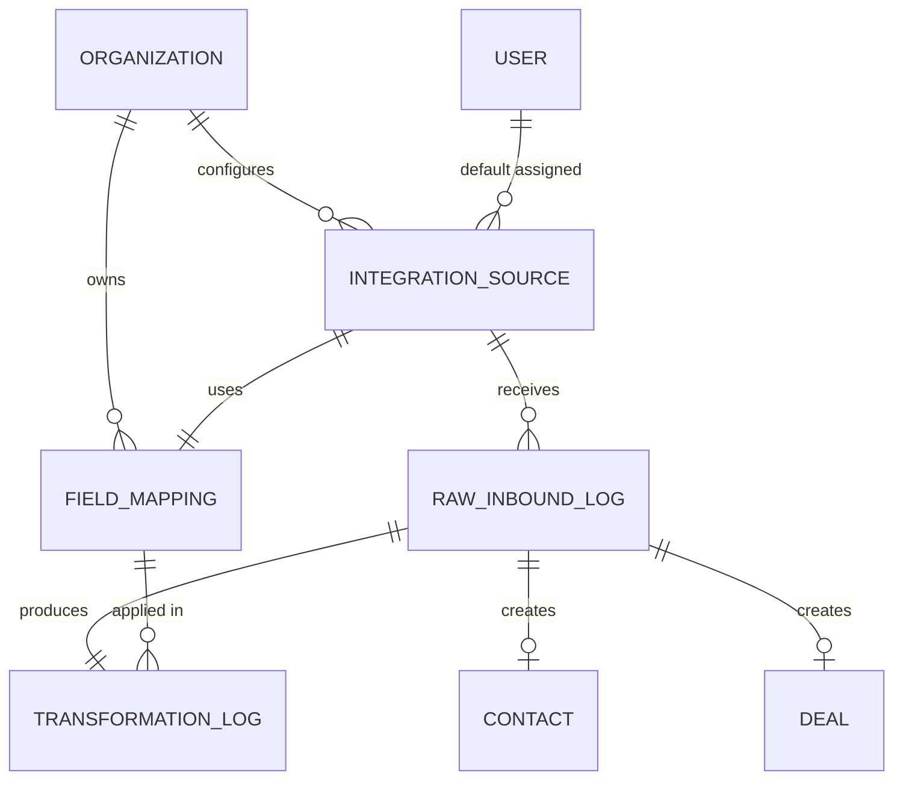

# CRM Transformation Engine - Data Model & Architecture

## Overview

The transformation engine sits between external data sources and the CRM's internal data model. It accepts raw payloads in any format, identifies the source, applies a mapping script to normalize the data, and outputs a standard Contact + Deal record.

```
[Google Ads] ──┐
[Facebook]  ──┤                    ┌─────────────┐     ┌────────────────┐     ┌──────────┐
[Website]   ──┼──► Generic Webhook ─► Raw Inbound ─► Transformation ──► Standard   ─► Contact
[Zapier]    ──┤    Endpoint        │  Log         │    Engine          │  Lead Format│  + Deal
[Manual CSV]──┤                    └─────────────┘     └────────────────┘     └──────────┘
[Custom]    ──┘                           │                    │
                                          │                    │
                                    (store everything)   (apply field map
                                    (never lose data)     + scripts)
```

---

## New Entities

### 1. INTEGRATION_SOURCE

Defines each external system that can send leads into the CRM. This is the registry of all connected sources.

```
INTEGRATION_SOURCE {
    uuid        id PK
    uuid        organization_id FK      -- multi-tenant: which business owns this
    string      name                    -- "Google Ads - Dallas Campaign"
    string      provider_type           -- "google_ads" | "facebook_ads" | "website_form" | "zapier" | "csv_upload" | "custom_webhook"
    string      api_key                 -- unique key for authenticating inbound webhooks
    string      webhook_url             -- auto-generated: /api/v1/webhooks/inbound/{api_key}
    boolean     is_active               -- toggle source on/off without deleting
    uuid        field_mapping_id FK     -- which mapping template to use
    string      default_pipeline_stage  -- which stage new leads land in (default: "new_lead")
    uuid        default_assigned_to FK  -- auto-assign leads to this user (nullable)
    jsonb       source_metadata         -- any extra config (Google account ID, Facebook page ID, etc.)
    timestamp   created_at
    timestamp   updated_at
}
```

### 2. FIELD_MAPPING

The mapping template that defines how raw fields translate into the CRM's standard format. Each integration source points to one of these. Multiple sources can share the same mapping if they use the same format.

```
FIELD_MAPPING {
    uuid        id PK
    uuid        organization_id FK
    string      name                    -- "Google Ads Lead Form - Standard"
    string      provider_type           -- matches INTEGRATION_SOURCE.provider_type
    boolean     is_system_default       -- true for pre-built mappings (Google, Facebook, etc.)
    jsonb       mapping_rules           -- the actual transformation logic (see below)
    jsonb       sample_payload          -- example raw payload for testing/reference
    timestamp   created_at
    timestamp   updated_at
}
```

#### mapping_rules JSON Structure

This is the core of the engine. Each rule maps a source field to a CRM field with optional transformations.

```json
{
  "rules": [
    {
      "source_field": "user_name",
      "target_field": "first_name",
      "transform": "split_space_first"
    },
    {
      "source_field": "user_name",
      "target_field": "last_name",
      "transform": "split_space_last"
    },
    {
      "source_field": "phone_number",
      "target_field": "phone",
      "transform": "normalize_phone"
    },
    {
      "source_field": "user_email",
      "target_field": "email",
      "transform": "lowercase_trim"
    },
    {
      "source_field": "street_address",
      "target_field": "address_line1",
      "transform": "none"
    },
    {
      "source_field": "campaign_name",
      "target_field": "lead_source_detail",
      "transform": "none"
    },
    {
      "source_field": "form_id",
      "target_field": "metadata.google_form_id",
      "transform": "none"
    }
  ],
  "static_values": {
    "lead_source": "google_ads"
  },
  "dedup_fields": ["email", "phone"]
}
```

#### Built-in Transform Functions

These are the reusable transformation functions the engine supports. Small business owners never see these directly. They just pick source fields and target fields in a UI, and select a transform from a dropdown.

```
TRANSFORM_FUNCTION {
    string      name                    -- function identifier
    string      description             -- human-readable explanation
}

Pre-built functions:
- "none"                  -- pass through as-is
- "lowercase_trim"        -- lowercase and strip whitespace
- "uppercase"             -- convert to uppercase
- "normalize_phone"       -- strip non-digits, add +1 if US, format consistently
- "split_space_first"     -- "John Smith" -> "John"
- "split_space_last"      -- "John Smith" -> "Smith"
- "split_comma_first"     -- "Smith, John" -> "Smith"
- "split_comma_last"      -- "Smith, John" -> "John"
- "parse_date"            -- attempt to parse any date string into ISO format
- "boolean_from_string"   -- "yes"/"true"/"1" -> true
- "strip_html"            -- remove HTML tags
- "truncate_255"          -- limit to 255 chars
- "map_values"            -- value mapping (see below)
- "regex_extract"         -- extract via regex pattern
- "concatenate"           -- join multiple source fields
- "custom_script"         -- user-defined Python/JS snippet (Phase 3)
```

#### Value Mapping Example (map_values)

For when source values need to be translated to CRM values:

```json
{
  "source_field": "interest_level",
  "target_field": "deal_priority",
  "transform": "map_values",
  "transform_config": {
    "High": "hot",
    "Medium": "warm",
    "Low": "cold",
    "_default": "warm"
  }
}
```

### 3. RAW_INBOUND_LOG

Every single payload that hits the webhook endpoint gets stored here before any transformation. This is the safety net. If a mapping is wrong, you can always reprocess from the raw data.

```
RAW_INBOUND_LOG {
    uuid        id PK
    uuid        organization_id FK
    uuid        integration_source_id FK
    string      source_ip               -- IP of the sender
    string      http_method             -- POST, PUT
    jsonb       headers                 -- full request headers
    text        raw_body                -- the exact payload as received (could be JSON, XML, form-encoded)
    string      content_type            -- "application/json" | "application/xml" | "application/x-www-form-urlencoded"
    jsonb       parsed_body             -- raw_body parsed into JSON regardless of original format
    string      processing_status       -- "received" | "parsed" | "mapped" | "contact_created" | "deal_created" | "error" | "duplicate" | "skipped"
    text        error_message           -- if processing_status = "error", what went wrong
    uuid        contact_id FK           -- nullable, linked after contact creation
    uuid        deal_id FK              -- nullable, linked after deal creation
    int         retry_count             -- number of reprocessing attempts
    timestamp   received_at
    timestamp   processed_at
}
```

### 4. TRANSFORMATION_LOG

Detailed log of what the engine did during transformation. Useful for debugging mapping issues.

```
TRANSFORMATION_LOG {
    uuid        id PK
    uuid        raw_inbound_log_id FK
    uuid        field_mapping_id FK
    jsonb       input_values            -- the fields extracted from raw payload
    jsonb       mapped_values           -- the fields after transformation
    jsonb       skipped_fields          -- source fields that had no mapping
    jsonb       errors                  -- per-field errors (e.g., phone normalization failed)
    string      dedup_result            -- "new" | "matched_email" | "matched_phone" | "matched_both"
    uuid        matched_contact_id FK   -- if dedup found existing contact
    timestamp   created_at
}
```

---

## Processing Pipeline

```
Step 1: RECEIVE
    Webhook endpoint receives POST at /api/v1/webhooks/inbound/{api_key}
    Validate api_key against INTEGRATION_SOURCE table
    Insert into RAW_INBOUND_LOG with status = "received"

Step 2: PARSE
    Detect content_type
    If JSON: parse directly
    If XML: convert to JSON
    If form-encoded: convert to JSON
    Store parsed_body in RAW_INBOUND_LOG
    Update status = "parsed"

Step 3: TRANSFORM
    Look up FIELD_MAPPING via INTEGRATION_SOURCE.field_mapping_id
    For each rule in mapping_rules:
        Extract source_field from parsed_body (supports dot notation: "data.user.name")
        Apply transform function
        Store in target_field
    Apply static_values
    Log everything in TRANSFORMATION_LOG
    Update status = "mapped"

Step 4: DEDUPLICATE
    Check dedup_fields against existing contacts
    If match found:
        Link to existing contact
        Optionally update contact fields if newer
        Log as "matched_email" / "matched_phone" / "matched_both"
    If no match:
        Create new contact
    Update status = "contact_created"

Step 5: CREATE DEAL
    Create new Deal linked to contact
    Set stage to INTEGRATION_SOURCE.default_pipeline_stage
    Set assigned_to from INTEGRATION_SOURCE.default_assigned_to
    Populate lead_source from static_values or provider_type
    Update status = "deal_created"

Step 6: NOTIFY
    If INTEGRATION_SOURCE.default_assigned_to is set:
        Send notification (email, in-app, SMS) to assigned rep
    "New lead from Google Ads: John Smith, 555-123-4567"
```

---

## Deduplication Logic

This is critical. Leads come in from multiple sources and the same person might submit forms twice.

```
Priority order for matching:
1. Email exact match (case-insensitive)
2. Phone exact match (after normalization)
3. Name + Address fuzzy match (configurable threshold)

Behavior on match:
- Do NOT create duplicate contact
- DO create a new Deal (they might be a returning customer)
- DO log the duplicate detection in TRANSFORMATION_LOG
- Optionally update contact fields if the new data is more complete
  (e.g., raw inbound has address but existing contact doesn't)
```

---

## Pre-built Mapping Templates

These ship with the product so common integrations work immediately with zero configuration.

### Google Ads Lead Form Extensions
```json
{
  "name": "Google Ads Lead Form - Default",
  "provider_type": "google_ads",
  "is_system_default": true,
  "mapping_rules": {
    "rules": [
      {"source_field": "user_column_data.0.string_value", "target_field": "first_name", "transform": "split_space_first"},
      {"source_field": "user_column_data.0.string_value", "target_field": "last_name", "transform": "split_space_last"},
      {"source_field": "user_column_data.1.string_value", "target_field": "email", "transform": "lowercase_trim"},
      {"source_field": "user_column_data.2.string_value", "target_field": "phone", "transform": "normalize_phone"},
      {"source_field": "campaign_id", "target_field": "metadata.google_campaign_id", "transform": "none"},
      {"source_field": "google_key", "target_field": "metadata.google_form_id", "transform": "none"}
    ],
    "static_values": {
      "lead_source": "google_ads"
    },
    "dedup_fields": ["email", "phone"]
  }
}
```

### Facebook Lead Ads
```json
{
  "name": "Facebook Lead Ads - Default",
  "provider_type": "facebook_ads",
  "is_system_default": true,
  "mapping_rules": {
    "rules": [
      {"source_field": "field_data.full_name", "target_field": "first_name", "transform": "split_space_first"},
      {"source_field": "field_data.full_name", "target_field": "last_name", "transform": "split_space_last"},
      {"source_field": "field_data.email", "target_field": "email", "transform": "lowercase_trim"},
      {"source_field": "field_data.phone_number", "target_field": "phone", "transform": "normalize_phone"},
      {"source_field": "field_data.street_address", "target_field": "address_line1", "transform": "none"},
      {"source_field": "field_data.city", "target_field": "city", "transform": "none"},
      {"source_field": "field_data.state", "target_field": "state", "transform": "uppercase"},
      {"source_field": "field_data.zip_code", "target_field": "zip", "transform": "none"},
      {"source_field": "ad_id", "target_field": "metadata.facebook_ad_id", "transform": "none"},
      {"source_field": "adset_id", "target_field": "metadata.facebook_adset_id", "transform": "none"},
      {"source_field": "campaign_id", "target_field": "metadata.facebook_campaign_id", "transform": "none"}
    ],
    "static_values": {
      "lead_source": "facebook_ads"
    },
    "dedup_fields": ["email", "phone"]
  }
}
```

### Generic Website Form (Catch-all)
```json
{
  "name": "Website Contact Form - Default",
  "provider_type": "website_form",
  "is_system_default": true,
  "mapping_rules": {
    "rules": [
      {"source_field": "name", "target_field": "first_name", "transform": "split_space_first"},
      {"source_field": "name", "target_field": "last_name", "transform": "split_space_last"},
      {"source_field": "first_name", "target_field": "first_name", "transform": "none"},
      {"source_field": "last_name", "target_field": "last_name", "transform": "none"},
      {"source_field": "email", "target_field": "email", "transform": "lowercase_trim"},
      {"source_field": "phone", "target_field": "phone", "transform": "normalize_phone"},
      {"source_field": "address", "target_field": "address_line1", "transform": "none"},
      {"source_field": "message", "target_field": "metadata.form_message", "transform": "none"}
    ],
    "static_values": {
      "lead_source": "website"
    },
    "dedup_fields": ["email", "phone"]
  }
}
```

---

## CSV Bulk Import

Not every lead source has an API. Sometimes your user has a spreadsheet from a trade show, a purchased lead list, or an export from their old CRM.

```
CSV Import Flow:
1. User uploads CSV file
2. System reads headers and shows them in a mapping UI
3. User drags CSV columns to CRM fields (or picks from dropdown)
4. System saves this as a FIELD_MAPPING with provider_type = "csv_upload"
5. System previews first 5 rows with transformations applied
6. User confirms
7. Each row processed through same pipeline (parse > transform > dedup > create)
8. Summary shown: X contacts created, Y deals created, Z duplicates skipped, W errors
```

---

## Reprocessing Capability

Because RAW_INBOUND_LOG stores every original payload, you can always reprocess:

```
Use cases:
- Mapping was wrong, fix it, reprocess all records from last 30 days
- New field added to CRM, update mapping, backfill from raw data
- Bug in transform function, fix it, reprocess errored records

Reprocessing flow:
1. Query RAW_INBOUND_LOG by date range, source, or status
2. For each record, run through Steps 2-5 again
3. Increment retry_count
4. Log new TRANSFORMATION_LOG entry
5. Update processing_status
```

---

## Entity Relationships (Mermaid)



---

## What This Enables for the End User

For a small business owner who is not technical:

1. **Out of the box**: Pick "Google Ads" from a list, get a webhook URL, paste it into Google. Done. Leads flow in.
2. **Semi-custom**: Upload a CSV, drag columns to fields in a UI. Import runs.
3. **Fully custom**: Point any system at the webhook URL, then use the mapping UI to define how fields translate.
4. **Never lose data**: Every raw payload is stored. If something goes wrong, reprocess.
5. **Dedup built in**: Same person submitting from Google and Facebook doesn't create two contacts.

No code required for any of this.
